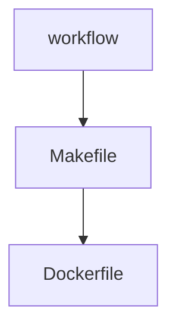

#  官方文档
-> https://docs.github.com/zh/get-started/writing-on-github/working-with-advanced-formatting/creating-diagrams
# 记录github workflow修改过程
一般流程


## 触发事件
### 自动触发
```
on:
  pull_request:  # PR事件触发
    branches:
      - "*"
    paths-ignore:
      - 'docs/**'
      - 'deploy/**'
      - '**.md'
      - 'images/**' # Images changes should be tested on their own workflow
      - '!images/nginx/**'

  push:       # push事件触发
    branches:
      - main
      - release-*
    paths-ignore:
      - 'docs/**'
      - 'deploy/**'
      - '**.md'
      - 'images/**' # Images changes should be tested on their own workflow
```
### 手动触发

```
  workflow_dispatch:    #手动触发；这样在workflow对应的Action都会有相应的envent trigger
    inputs:
      run_e2e:
        description: 'Force e2e to run'
        required: false
        type: boolean
```

## 镜像编译与PUSH
- 一般会在build等step中
1、需要登录阿里云等镜像仓库，如
           docker login --username=${{ secrets.USERNAME_ALI }} registry.cn-hangzhou.aliyuncs.com -p ${{ secrets.PASSWORD_ALI }}        
2、需要编译二级制
通常会有docker build || docker buildx；且docker buildx主要负责manifest的二进制
3、push镜像
尽量不要改动原有workflow，通常Makefile中会有以下代码,编译以及PUSH manifest镜像的过程
```
.PHONY: release # Build a multi-arch docker image
release: 
	echo "Building binaries..."
	$(foreach PLATFORM,$(PLATFORMS), echo -n "$(PLATFORM)..."; ARCH=$(PLATFORM) make build;)

	echo "Building and pushing ingress-nginx image...$(BUILDX_PLATFORMS)"

	docker buildx build \ #使用 Docker BuildKit 的扩展工具 buildx 来构建镜像，支持跨平台、多节点等功能。
		--no-cache \禁用构建缓存，确保每个步骤都从头开始执行（避免缓存导致镜像不一致）。
		$(MAC_DOCKER_FLAGS) \
		--push \ ## 构建完成后自动 push 到镜像仓库
		--progress plain \ #使用 plain 格式输出构建日志，方便在 CI 环境中查看。
		--platform $(BUILDX_PLATFORMS) \ #指定要构建的平台，比如 linux/amd64,linux/arm64。这个变量定义的是目标平台列表。
		--build-arg BASE_IMAGE="$(BASE_IMAGE)" \ #传递 Dockerfile 中 ARG BASE_IMAGE 的值，用来控制基础镜像（通常是 FROM ${BASE_IMAGE}）。
		--build-arg VERSION="$(TAG)" \ #给 Dockerfile 传递 VERSION 参数，比如镜像内部展示版本号。
		--build-arg COMMIT_SHA="$(COMMIT_SHA)" \ #传递 Git 提交 SHA，方便镜像追踪源代码版本。
		--build-arg BUILD_ID="$(BUILD_ID)" \ #传递 CI 中的构建 ID，可以写入镜像 metadata，便于追踪。
		-t $(REGISTRY)/controller:$(TAG) rootfs #镜像上下文路径，即 Dockerfile 和相关资源所在目录，当前是 rootfs 目录。
    docker buildx build --output type=registry \ #	表示构建后直接推送到镜像仓库（等价于 --push，但更灵活）
		--build-arg VERSION=$(VERSION) \ 
		--tag $(REGISTRY)/$*:$(VERSION) \ #设置镜像 tag，其中 $* 表示当前目标（Makefile 规则中传入的），例如 controller、agent。结果可能是：
registry.cn/myrepo/controller:v1.2.3。
		--platform $(shell echo $(addprefix linux/,$(ARCHS)) | sed 's/ /,/g') \ # sed 's/ /,/g')`
		--target $* \ #	构建 Dockerfile 中的指定阶段，比如 FROM base as controller，你可以只构建 controller 阶段而不是整个镜像。适用于多阶段构建。
		.
```

